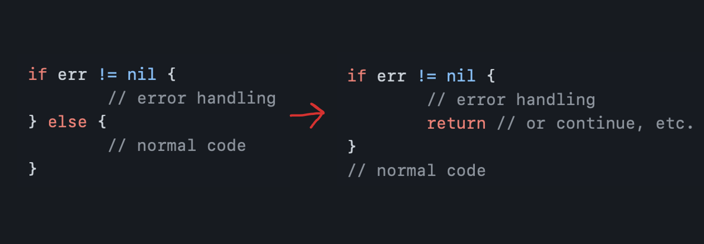
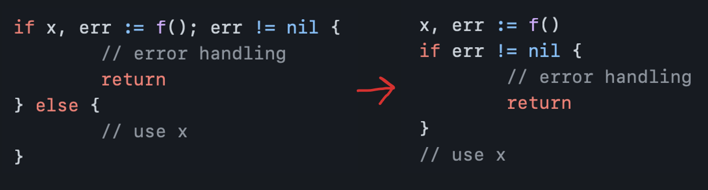

# Error

[Go Code Review Comments](https://github.com/golang/go/wiki/CodeReviewComments/5a40ba36d388ff1b8b2dd4c1c3fe820b8313152f): `Indent Error Flow`

Try to keep the normal code path at a minimal indentation, and indent the error handling, dealing with it first. This improves the readability of the code by permitting visually scanning the normal path quickly.

For instance:



## Example 


### Source code
```go
if cur_game_stage == game.EGST_FEATURE_GAME {
	if cached_coin_size_index, cached_num_lines, err := GetCachedClientSpinRequest(csr.UserID, cache); err == nil {
		if _, err = game_conf.GetCoinSizeByIndex(cached_coin_size_index); err == nil {
			if game_conf.IsValidNumLines(cached_num_lines) == true {
				coin_size, _ = game_conf.GetCoinSizeByIndex(cached_coin_size_index)
				num_lines = cached_num_lines
				bet_money = coin_size * float64(num_lines)
			} else {
				c.JSON(http.StatusBadRequest, ginutils.Resp{
					Status: core.EseInvalidFields.Int(),
				})

				return
			}
		} else {
			c.JSON(http.StatusBadRequest, ginutils.Resp{
				Status: core.EseInvalidFields.Int(),
				Msg:    err.Error(),
			})

			return
		}
	} else {
		c.JSON(http.StatusInternalServerError, ginutils.Resp{
			Status: core.EseAccessDB.Int(),
			Msg:    err.Error(),
		})

		return
	}
}
```

### Pseudocode
```go
if 處於 Feature 階段 {
	if CoinSizeIndex, NumLines, err := 獲取緩存請求數據(); err == nil {
		if _, err := 獲得具體CoinSize(); err == nil{
			if 是合理的NumLines嗎() == true {
				SetCoinSize()
				SetNumLines()
				SetBetMoney()
			} else {
				JSON(BadRequest, 錯誤的Fiedls)
				return
			}
		} else {
			JSON(BadRequest, 錯誤的Fiedls)
			return		
		}
	} else {
		JSON(BadRequest, 錯誤的AccessDB)
		return	
	}
}
```

### Final Code
```go
if 處於 Feature 階段 {
	CoinSizeIndex, NumLines, err := 獲取緩存請求數據();
	if err != nil {
		JSON(BadRequest, 錯誤的AccessDB)
		return	
	} 

	_, err := 獲得具體CoinSize()
	if err != nil{
		JSON(BadRequest, 錯誤的Fiedls)
		return		
	}	

	if 是合理的NumLines嗎() != true {
		JSON(BadRequest, 錯誤的Fiedls)
		return
	} 

	SetCoinSize()
	SetNumLines()
	SetBetMoney()
}
```

## Sentinel Error
预定义的特定错误，对于GO，我们使用特定的值表示错误。

`if err == ErrSomething(...)`

- 不应依赖检测 error.Error 的输出。
- Sentinel errors 最后会成为你 API 公共部分
	- 如果定义了特定值的错误，那么该值必须是公共的，当然要有文档记录，这会增加API 暴露的表面积。
- 它在两个包之间创建了依赖。

## Error types

### os.PathError
```go
type PathError struct {
	Op stirng
	Path string
	Err error
}
```
需要 type 断言和 swtich，同样会让 error 变成 public.


## Opaque errors (不透明错误)
只需返回错误，而不假设内容，但是不知道上下文。

```go
// package 級別可見
type temporay interface {
	Temporary() bool
}

func IsTemporary(err error) bool {
	te, ok := err.(temporary)
	return ok && te.Temporary()
}
```
在包内部断言，返回的是一种行为，在不了解底层的情况下也可以知道一些信息。

- package net

### Counter
```go
func CountLines(r io.Reader) (int, error) {
	var (
		br = bufio.NewReader(r)
		lines int
		err error
	)

	for {
		_, err = br.ReadStirng('\n')
		// 如果 err == EOF，lines仍需++
		lines++
		if err != nil {
			break
		}
	}

	if err != io.EOF {
		return 0, err
	}
	return lines,nil
}
```

```go
func CountLines(r io.Reader) (int, error) {
	sc := bufio.NewScanner(r)
	lines := 0
	// 如果还有下一行，true 继续
	// 如果遇到 error， 暂存 err (setErr("..."))，然后false 退出
	for sc.Scan() {
		lines++
	}

	return lines, sc.Err()
}
```
类似 sql 的 sql.Rows: Rows.Next

```go
func WriteResponse(...){
	...
	k_test.go
}
```


## Wrap errors
Go：沒有 Java exception 那種自帶堆棧信息的try catch，找問題麻煩
```go
// 處理一個錯誤時，帶了兩個任務 ———— 要麼只處理錯誤，要麼處理錯誤
func WriterAll(w io.Writer, buf []byte) error {
	_, err := w.Write(buf)
	if err != nil {
		log.Println("unable to write:", err)
		return err
	}

	return nil
}
```

```go
// 處理一個錯誤時，帶了兩個任務 ———— 要麼只處理錯誤，要麼處理錯誤
func WriterAll(w io.Writer, buf []byte) error {
	_, err := w.Write(buf)
	return errors.Wrap(err, "unable to write:")
}
```

## Wrapping errors with %w
```go
if err != nil {
	return fmt.Errorf("decompress %v: %v", name ,err)
}
```
`fmt.Errorf` 支持 `%w` 後
```go
if err != nil {
	return fmt.Errorf("decompress %v: %w", name ,err)
}
```
用 `%w` 包裝錯誤後，可用於 `errors.Is` 以及 `errors.As`
```go

var ErrPermission = errors.New("error permission")
err := fmt.Errorf("access denied: %w", ErrPermission)
//...
if errors.Is(err, ErrPermission) { /*...*/ }
```