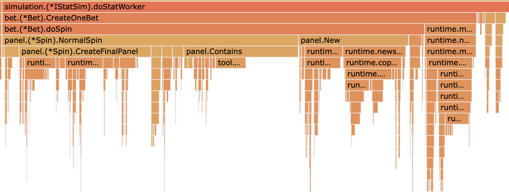

# Pool

## sync.Pool

### 是什麼

對於很多需要重複分配、回收記憶體的地方，sync.Pool 是一個很好的選擇。頻繁地分配、回收記憶體會給 GC 帶來一定的負擔，嚴重的時候會引起 CPU 的毛刺，而 sync.Pool 可以將暫時不用的物件快取起來，待下次需要的時候直接使用，不用再次經過記憶體分配，複用物件的記憶體，減輕 GC 的壓力，提升系統的效能。

### 使用場景

當多個 goroutine 都需要建立同⼀個物件的時候，如果 goroutine 數過多，導致物件的建立數⽬劇增，進⽽導致 GC 壓⼒增大。形成 “高併發－高記憶體佔用率－GC 緩慢－系統處理併發⼒降低－更高併發”這樣的惡性迴圈。

在這個時候，需要有⼀個物件池，每個 goroutine 不再⾃⼰單獨建立物件，⽽是從物件池中獲取出⼀個物件（如果池中已經有的話），使用完畢後再放回池中。

### 使用方法

- sync.Pool
  - New: 用設定好的函式初始化一個新的物件
  - Get( ): 如果池裡沒物件，通過New設定的函式獲得物件，如果有，直接取物件來用
  - Put( ): 將物件放回池子裡，但是系統不會幫我們清空物件

### 使用範例

Define


Using


所以我們需要對數據做清除後放入

## 實際使用場景

### 場景流程介紹

Banchmark


DoStat


Spin流程


### 未優化前性能測試

未優化前1000


`allocs/op` means how many distinct memory allocations occurred per op (single iteration).

`B/op` is how many bytes were allocated per op.

未優化火焰圖



未優化前NormalSpin()


未優化前CreateFinalPanel


未優化前New


### 開始優化cMap

Benchmark


InitPool設計

```go
// Pool for cMap
var Pool *sync.Pool
func InitPool(){
	Pool = &sync.Pool{
		New: func() interface{} {
			result := make(map[int][]int)
			for i := 0; i <= 11; i++ {
				result[i] = make([]int, 0, 15)
			}
			return result
		},
	}
}
```

CleanMap設計


優化CMap後1000


優化CMap後火焰圖


CreateFinalPanelPerf


CleanMap Perf


### 開始優化 Spin.New()

SpinPool設計


優化New後1000


New


NewPerf


CleanSpin


### 優化 資料結構

DataType


優化結構後1000


### cMap & fMap 整合進 &Spin{}

整合進Spin


重構後


重構後火焰圖


### tSlice 臨時變數 整合進 Spin

重構後1000


### Top 查看服務器狀態

不控制併發


控制併發


### 將 Bet 也加入 Pool

BetPool


Benchmark


### []Spin -> []*Spin

InitBetPool


OneBetResult


FreeBet


Benchmark


火焰圖:


## Reference

[深度解密 Go 語言之 sync.Pool](https://iter01.com/502239.html)
